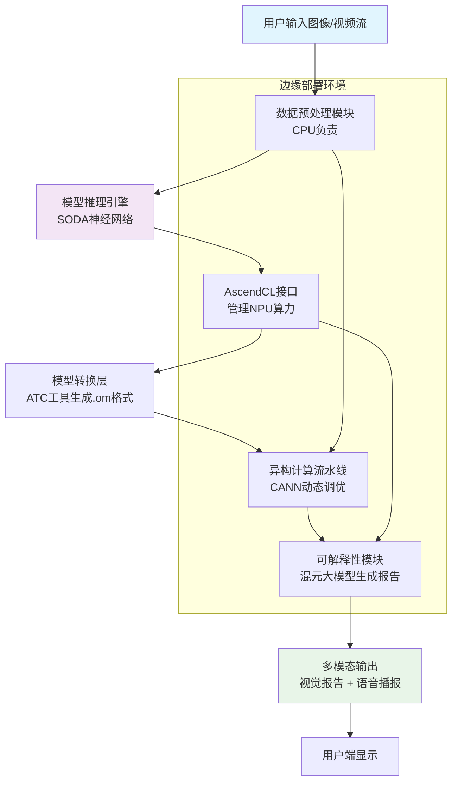
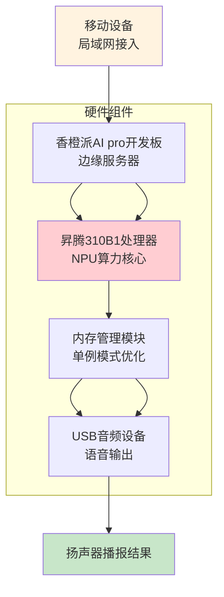

# AI合成图像检测系统设计文档

## 项目背景

随着AI技术的飞速发展，SORA、混元等大模型生成图片的能力日益增强，生成的图片已达到以假乱真的效果，导致AI生成图片被滥用于牟取私利等乱象。因此，准确快速地检测AI生成图像变得至关重要。本项目基于华为昇腾AI处理器和香橙派AI Pro开发板，开发了一套AI合成图像检测系统，旨在解决这一痛点。

深度学习网络在数字图像处理和识别领域取得了突破性进展，为系统提供了技术基础。

华为昇腾AI处理器以其高性能计算能力，为深度学习提供了强大的硬件支持。

香橙派AI Pro开发板作为开源硬件，为边缘AI部署提供了便携工具。

## 软件架构图

本系统的软件架构基于昇腾AI全栈软件平台（包括CANN软件栈和AscendCL接口），采用模块化设计，确保高效推理和可扩展性。软件架构主要分为以下层次：

- **应用层**：提供Web界面（通过Flask框架构建RESTful API）和语音交互模块，支持用户上传图像并获取检测结果。
- **服务层**：包括模型推理引擎和可解释性模块。模型推理引擎通过AscendCL接口调用NPU算力，实现端到端推理流水线；可解释性模块集成混元大模型，将二分类结果转化为自然语言描述。
- **模型层**：核心为自研的SODA（Safe and OSD Detection for AIGC Images）深度神经网络，该网络结合语义特征和频率特征，轻量化设计（400MB），支持毫秒级处理（166.48 FPS）。
- **支撑层**：包括ATC工具用于模型转换（将模型转换为.om格式）、自定义算子处理（如DWT预处理），以及资源管理策略（如单例模式管理模型实例）。

**软件架构流程图**

架构特点：采用异构计算流水线，CPU负责数据预处理和后处理，NPU专注模型推理，通过CANN动态调优实现高效运行。

## 硬件架构图

系统硬件架构以边缘计算为核心，利用华为昇腾AI处理器和香橙派AI Pro开发板构建低成本、高性能的部署方案。硬件组件包括：

- **核心计算单元**：华为昇腾310B1处理器，采用达芬奇架构，提供张量计算核心，支持高效卷积和矩阵运算。
- **边缘设备**：香橙派AI Pro开发板，作为服务器载体，集成NPU算力，并通过USB接口连接音频设备（如扬声器）实现语音输出。
- **网络模块**：支持局域网通信，允许移动设备通过Wi-Fi接入香橙派服务器。
- **存储与内存**：开发板内置内存，通过优化策略（如一次性模型加载）保障稳定运行。

**硬件连接图**

硬件优势：昇腾处理器提供硬件级优化（如层间融合），香橙派开发板确保轻量化和边缘部署可行性。

## 4功能列表

本系统的主要功能如下：

- **实时AI图像检测**：支持对上传图像或视频流进行实时分析，精准识别AI生成内容，准确率高达97%（原图）和80%（压缩/干扰图）。
- **多模态结果输出**： 视觉报告：结合混元大模型生成技术解释，突出纹理异常、光影悖论等决策依据。 语音播报：通过VoiceCraft API和USB音频设备，以语音形式输出检测结果，支持语速、音调调节。
- **边缘化部署**：通过香橙派开发板实现本地推理，减少云端依赖，支持局域网内多设备接入。
- **用户友好界面**：基于Web的RESTful API，允许用户通过浏览器轻松上传图像并查看结果。
- **资源高效管理**：采用内存优化策略（如模型共享实例），确保在资源约束下稳定运行。

## 是否使用当前技术

**是，本项目全面采用当前先进技术**，具体体现为：

- **硬件技术**：使用华为昇腾AI处理器（310B1型号），基于最新达芬奇架构，提供高性能异构计算能力；香橙派AI Pro开发板代表边缘计算的前沿硬件。
- **软件技术**：集成CANN软件栈和AscendCL接口，实现动态调优；自研SOD神经网络结合频率和语义特征，符合轻量化AI趋势。
- **AI模型**：引入混元大模型用于可解释性处理，体现多模态融合的当前研究方向；VoiceCraft语音平台基于Microsoft Edge TTS，支持实时语音生成。
- **部署方式**：边缘部署模式契合当前AIoT（人工智能物联网）发展潮流，强调低延迟和隐私保护。